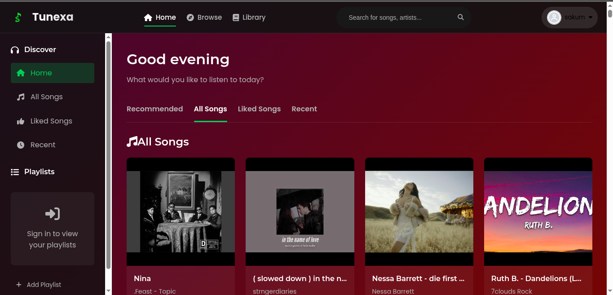
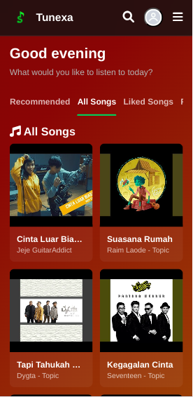
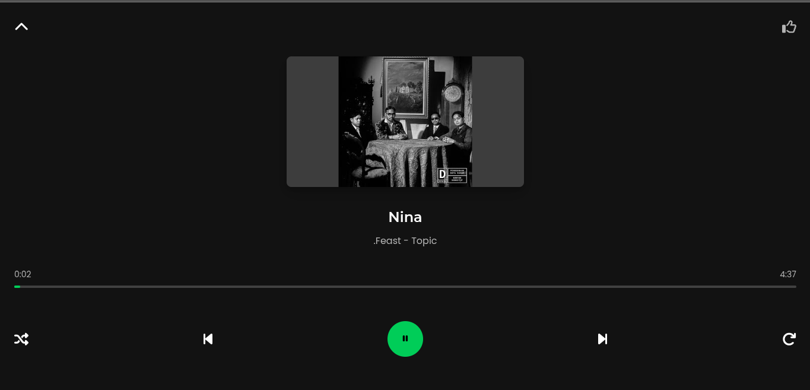
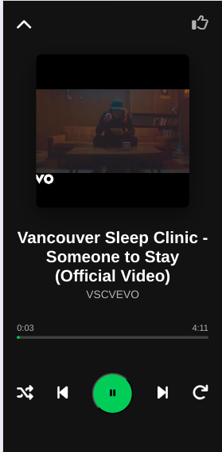
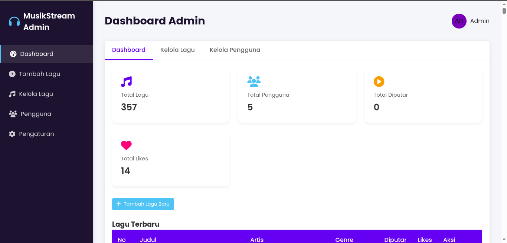

### ✅ Pembaruan:

# Musik Web App 🎵

Aplikasi web musik berbasis **Flask** Python yang memungkinkan pengguna untuk mencari lagu, mengunduh lagu dari YouTube dan Spotify, membuat playlist, serta memutar lagu langsung di browser. Aplikasi ini dikembangkan oleh **Sakum** dan dibantu oleh AI untuk mempercepat pengembangan serta otomasi berbagai fitur canggih.

---

## ✨ Fitur
- 🔍 **Pencarian Lagu**: Fungsi pencarian lagu yang muncul sesuai judul music yang ada di database anda.
- ⬇️ **Unduh Lagu**: Lagu akan diunduh otomatis.
- 📁 **Playlist**: Masih Blum berfungsi masih pengembangan.
- 🎧 **Pemutar Musik**: Putar lagu langsung di dalam browser dengan tampilan sederhana dan responsif.
- 🛠️ **Admin Panel**: Admin dapat mengunggah lagu dengan otomatis hanya dengan menempelkan link music dari youtube maupun spotify dan juga ada untuk mengedit lagu atau menghapus lagu.
- ⚙️ **Minifikasi Otomatis**: HTML, CSS, dan JavaScript akan di-minify otomatis agar lebih cepat saat diakses.
- 🔐 **Login dan Register**: Fitur otentikasi pengguna masih belum sempurna.

---

## ⚙️ Teknologi yang Digunakan
- **Backend**: Python + Flask
- **Database**: MySQL (pymysql)
- **YouTube API**: Untuk metadata dan pencarian lagu
- **Spotify API**: Untuk metadata lagu
- **YT-DLP**: Downloader lagu dari YouTube
- **Flask-Minify**: Untuk minifikasi otomatis HTML, JS, CSS
- **python-dotenv**: Memuat konfigurasi sensitif dari file `.env`

---

## 🚀 Instalasi

1. **Clone Repository**
   ```bash
   git clone https://github.com/SakumDisiniPa/web-music.git
   cd web-music
   ```

2. **Import table ke database**

   ```bash
   #bisa langsung/lebih mudah di phpmyadmin
   mysql -u root #jika tidak ada password
   mysql -u root -p #jika ada password
   CREATE DATABASE musik_app;
   EXIT;
   mysql -u root -p musik_app < musik_app.sql
   ```

3. **Buat dan aktifkan virtual environment**

   ```bash
   python3 -m venv venv
   source venv/bin/activate  # di Linux/macOS
   source venv/bin/activate.fish  # jika menggunakan terminal fish
   venv\Scripts\activate   # di Windows
   ```

4. **Instal semua dependencies**

   ```bash
   pip install -r requirements.txt
   ```

5. **Edit file `.env`**

6. **Jalankan aplikasinya**

   ```bash
   python server.py
   python3 server.py # jika pertama gagal
   ```

---

## 🔐 Cara Mendapatkan API Key

Aplikasi ini membutuhkan berbagai API Key agar dapat terhubung ke layanan eksternal.

### 🎬 YouTube Data API v3

Untuk mengambil metadata lagu dari YouTube:

1. Kunjungi [Google Cloud Console](https://console.cloud.google.com/)
2. Buat atau pilih project.
3. Buka **API & Services > Library**
4. Cari **YouTube Data API v3** dan klik **Enable**
5. Buka **Credentials > Create Credentials > API Key**

Tambahkan ke `.env`:

```env
YOUTUBE_API_KEY=API_KEY_KAMU
```

---

### 🎧 Spotify API (Client ID & Secret)

1. Kunjungi [Spotify Developer Dashboard](https://developer.spotify.com/dashboard/)
2. Login dan klik **Create an App**
3. Salin `Client ID` dan `Client Secret`

Tambahkan ke `.env`:

```env
SPOTIFY_CLIENT_ID=CLIENT_ID_KAMU
SPOTIFY_CLIENT_SECRET=CLIENT_SECRET_KAMU
```

---

### 🟦 Google OAuth

1. Buka [Google Cloud Console](https://console.cloud.google.com/)
2. Pilih project > **OAuth consent screen** → isi informasi dasar
3. Buka **Credentials > Create Credentials > OAuth client ID**
4. Pilih **Web Application**, isi `redirect URI`, lalu buat

Tambahkan ke `.env`:

```env
GOOGLE_CLIENT_ID=YOUR_CLIENT_ID
GOOGLE_CLIENT_SECRET=YOUR_CLIENT_SECRET
```

---

### 🔒 Turnstile CAPTCHA (Cloudflare)

1. Buka [Cloudflare Turnstile](https://dash.cloudflare.com/)
2. Buat site baru
3. Salin `Site Key` dan `Secret Key`

Tambahkan ke `.env`:

```env
TURNSTILE_SITE_KEY=YOUR_SITE_KEY
TURNSTILE_SECRET_KEY=YOUR_SECRET_KEY
```

---

### 🐙 GitHub OAuth

1. Kunjungi [GitHub Developer Settings](https://github.com/settings/developers)
2. Buat aplikasi OAuth baru
3. Isi `Authorization callback URL`
4. Salin `Client ID` dan `Client Secret`

Tambahkan ke `.env`:

```env
GITHUB_CLIENT_ID=YOUR_CLIENT_ID
GITHUB_CLIENT_SECRET=YOUR_CLIENT_SECRET
```

---

### 📘 Facebook OAuth

1. Buka [Facebook Developers](https://developers.facebook.com/)
2. Buat Aplikasi > Tambahkan **Facebook Login**
3. Atur **Valid OAuth Redirect URIs**
4. Dapatkan `App ID` dan `App Secret`

Tambahkan ke `.env`:

```env
FACEBOOK_CLIENT_ID=YOUR_APP_ID
FACEBOOK_CLIENT_SECRET=YOUR_APP_SECRET
```

---

## 📸 Screenshot

Berikut beberapa tampilan dari aplikasi:

### 🎵 Halaman Utama




### 🎧 Halaman Pemutar Lagu




### 🛠️ Halaman Admin Panel



---

## 📄 [Lisensi](https://github.com/SakumDisiniPa/web-music/blob/main/LICENSE)

Open source project by Sakum & AI 🤖. Bebas digunakan untuk belajar dan pengembangan.

---

